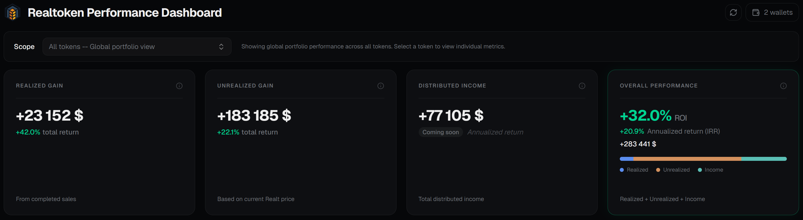
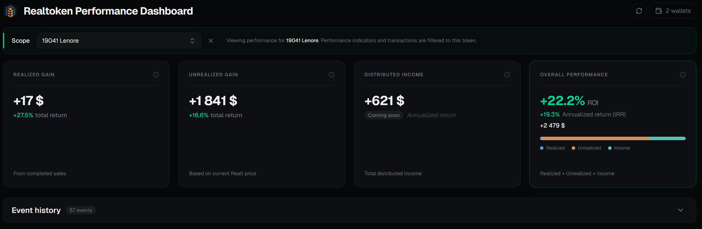
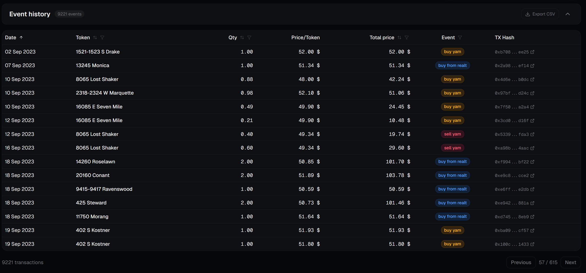

# RealToken Performance Dashboard

## Important Dependency

This project is **not standalone**.
It is the **frontend dashboard layer** and strictly depends on the backend API: [realtoken-performance-api](https://github.com/RealToken-Community/realtoken-performance-api)

---

## Overview

The **RealToken Performance Dashboard** provides a clear and interactive visualization of financial performance for RealToken holders.

It allows users to analyze their investments with flexible levels of detail:

- **Global portfolio view**
- **Per-token performance view**
- **Detailed event history**

---

## Demo

### Global Performance

### Single Token Performance

### Event History

---

## Performance Model

The dashboard displays performance based on four main indicators:

### 1. Realized Gains
Profit or loss generated from **closed positions**, calculated using the **Weighted Average Cost (WAC)** methodology.

### 2. Unrealized Gains
Profit or loss from **open positions**, based on:
- current RealT valuation
- weighted acquisition cost

### 3. Distributed Income
All income **actually received**, including:
- rental income
- factoring
- interest payments

These values are computed from RealT distribution data.

### 4. Overall Performance

The **overall performance** aggregates all components:

- Realized Gains  
- Unrealized Gains  
- Distributed Income  

It provides two key metrics:

- **ROI (Return on Investment)**  
  → Total return over the entire holding period

- **IRR (Internal Rate of Return)**  
  → Annualized performance, taking timing of cash flows into account